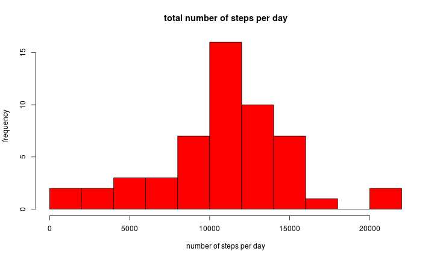
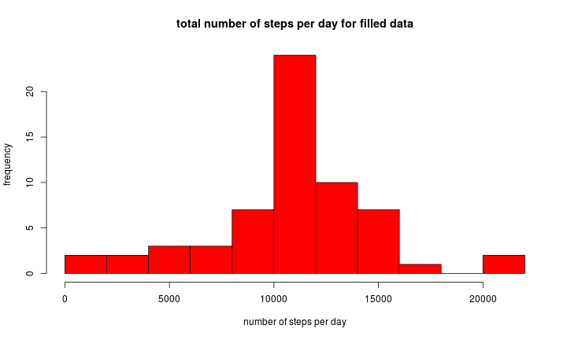
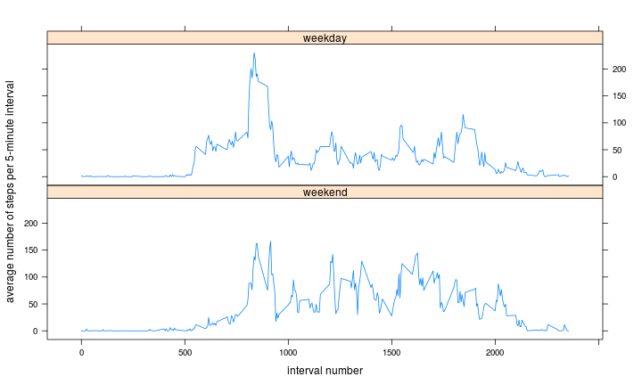

# Reproducible Research: Peer Assessment 1

## Loading and preprocessing the data

Load data from CSV file:

```r
data <- read.csv("activity.csv", header=TRUE, stringsAsFactors=FALSE)
```

Convert variable "date" to proper R date format:

```r
data$date <- as.Date(strptime(data$date, format="%Y-%m-%d"))
```

## What is mean total number of steps taken per day?

Analysis of mean total number of steps taken per day, for this we omit
incomplete measurements:

```r
comp.data <- data[complete.cases(data),]
```

Calculate number of steps per day and assign meaning variables names:

```r
daily.steps <- aggregate(comp.data$steps,list(comp.data$date),FUN=sum)
col.names <- c("date","total.steps")
colnames(daily.steps) <- col.names
```

Plot total number of steps per day:

```r
hist(daily.steps$total.steps,breaks=10,col="red",main="total number of steps per day",xlab="number of steps per day",ylab="frequency")
```

 

Calculate mean and median of total number of steps per day:

```r
paste("Mean value of total number of steps per day:",as.integer(mean(daily.steps$total.steps)))
```

```
## [1] "Mean value of total number of steps per day: 10766"
```

```r
paste("Median value of total number of steps per day:",as.integer(median(daily.steps$total.steps)))
```

```
## [1] "Median value of total number of steps per day: 10765"
```

## What is the average daily activity pattern?

Calculate average number of steps taken per 5-minute interval:

```r
interval.avg <- aggregate(comp.data$steps,list(comp.data$interval),FUN=mean,na.omit=TRUE)
col.names <- c("interval.no","avg.steps")
colnames(interval.avg) <- col.names
```

Plot average no of steps per interval:

```r
plot(interval.avg,type="l",main="average no of steps per 5-minute interval",xlab="interval number","average no of steps")
```

 

Find interval with maximum number of steps:

```r
max.int <- sort(interval.avg$avg.steps,decreasing=TRUE,index.return=TRUE)
paste("Index of interval with maximum steps (daily average):",max.int$ix[1])
```

```
## [1] "Index of interval with maximum steps (daily average): 104"
```

## Imputing missing values

Calculate total number of rows with missing values:

```r
paste("Number of rows with missing values:",nrow(data)-nrow(comp.data))
```

```
## [1] "Number of rows with missing values: 2304"
```

Replace missing values with average (mean) values for the corresponding
5-minute interval; new data set "mod.data" is equal to original dataset
but with missing data filled in:

```r
filled.data <- data
for(i in 1:nrow(data)){
    if(is.na(filled.data[i,1])){
        filled.data[i,1] <- interval.avg[filled.data[i,3]==interval.avg$interval.no,2]
    }
}
```

Calculate number of steps per day for filled-in data and assign meaning variables names:

```r
daily.steps.filled <- aggregate(filled.data$steps,list(filled.data$date),FUN=sum)
col.names <- c("date","total.steps")
colnames(daily.steps.filled) <- col.names
```

Plot total number of steps per day for filled-in data:

```r
hist(daily.steps.filled$total.steps,breaks=10,col="red",main="total number of steps per day for filled data",xlab="number of steps per day",ylab="frequency")
```

 

Calculate mean and median of total number of steps per day for filled data:

```r
paste("Mean value of total number of steps per day:",as.integer(mean(daily.steps.filled$total.steps)))
```

```
## [1] "Mean value of total number of steps per day: 10766"
```

```r
paste("Median value of total number of steps per day:",as.integer(median(daily.steps.filled$total.steps)))
```

```
## [1] "Median value of total number of steps per day: 10766"
```

There appears to be no significant difference in compared to the
first part of the assignment.

## Are there differences in activity patterns between weekdays and
weekends?

Add column indicating whether a given date is a weekend day:

```r
filled.data$is.weekend <- factor(as.POSIXlt(filled.data[,2])$wday %in% c(0,6), levels=c("TRUE","FALSE"),labels=c("weekend","weekday"))
```

Calculate average number of steps taken per 5-minute interval for filled data:

```r
interval.avg.filled <- aggregate(filled.data$steps,list(filled.data$interval,filled.data$is.weekend),FUN=mean,na.omit=TRUE)
col.names <- c("interval.no","weekend.indicator","avg.steps")
colnames(interval.avg.filled) <- col.names
head(interval.avg.filled)
```

```
##   interval.no weekend.indicator avg.steps
## 1           0           weekend  0.214623
## 2           5           weekend  0.042453
## 3          10           weekend  0.016509
## 4          15           weekend  0.018868
## 5          20           weekend  0.009434
## 6          25           weekend  3.511792
```

Create panel plot using lattice plotting system:

```r
library(lattice)
xyplot(interval.avg.filled$avg.steps ~ interval.avg.filled$interval.no | interval.avg.filled$weekend.indicator,xlab="interval number",ylab="average number of steps per 5-minute interval",layout=c(1,2),type="l")
```

 
